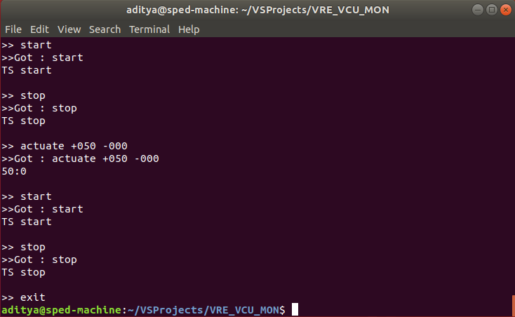
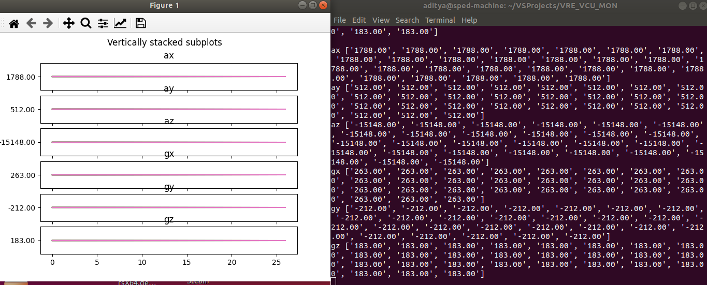

# Bluetooth Serial Controller





A robust bluetooth serial controller to display accelerometer data, CAN data, SD card logs, live graphs and remote shutdown the car

## Usage
```python
from CAR_API import Car        
car = Car()

# To engage TS
car.start()

# To disengage TS
car.stop()

# To actuate
car.actuate(throttle, steering)

# To enable regen
car.regen = True

# Get data from car
data = car.get_data()
"""
	data is a dict of the format 
	 {'ax': 1788.0, ' ay': 512.0, ' az': -15148.0, ' gx': 263.0, ' gy': -212.0, ' gz': 183.0, ' CURRENT_DRAW_L': 1616.0, ' CURRENT_DRAW_R': 1918.0, ' throttle_val': 1.0, ' steering_val': 0.0, ' RTC_TIME': 0.0}
"""

```

## TODO

1. Live Graphing of data
2. Safety Start/Stop UI and Audio indicators
3. Command Line access to vehicle
4. Reliability testing

## Data format

Data fromat is 4 bytes of the following format

```python
b0 = ord(';')
b1 = 	self.shutdown<<7 	^ 
	self.parity<<6 		^ 
	self.log<<5 		^ 
	self.regen<<4 		^ 
	self.left<<1 		^ 
	self.reverse<<0
b2 = self.throttle
b3 = self.steering

bytearray([b0, b1, b2, b3])
```

## Setup and Dependencies

Install the following

```bash
sudo apt-get install bluetooth libbluetooth-dev
python3 -m pip install -r requirements.txt
```

To scan for devices :
```bash
hcitool scan
Scanning ...
	AC:67:B2:36:23:0E	VRE_VCU
```

To bind :
```bash
# bind 0 refers to device number 0 (rfcomm0) and 1 is the channel.
sudo rfcomm bind 0 AC:67:B2:36:23:0E 1
```
Now, pySerial at /dev/rfcomm0 with 115200 baud rate will work.

## Refrences

https://askubuntu.com/questions/114171/why-is-dev-rfcomm0-giving-pyserial-problems

https://www.programmersought.com/article/10551229226/

https://unix.stackexchange.com/questions/92255/how-do-i-connect-and-send-data-to-a-bluetooth-serial-port-on-linux
